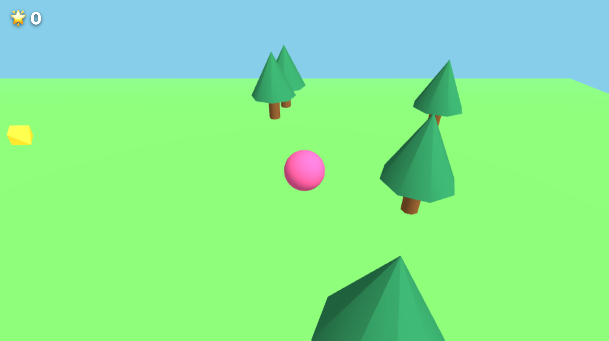
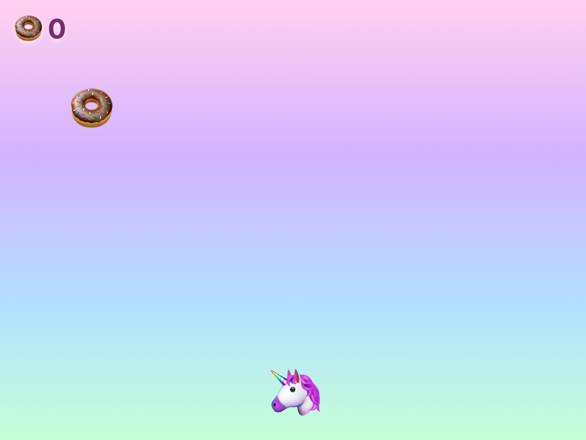
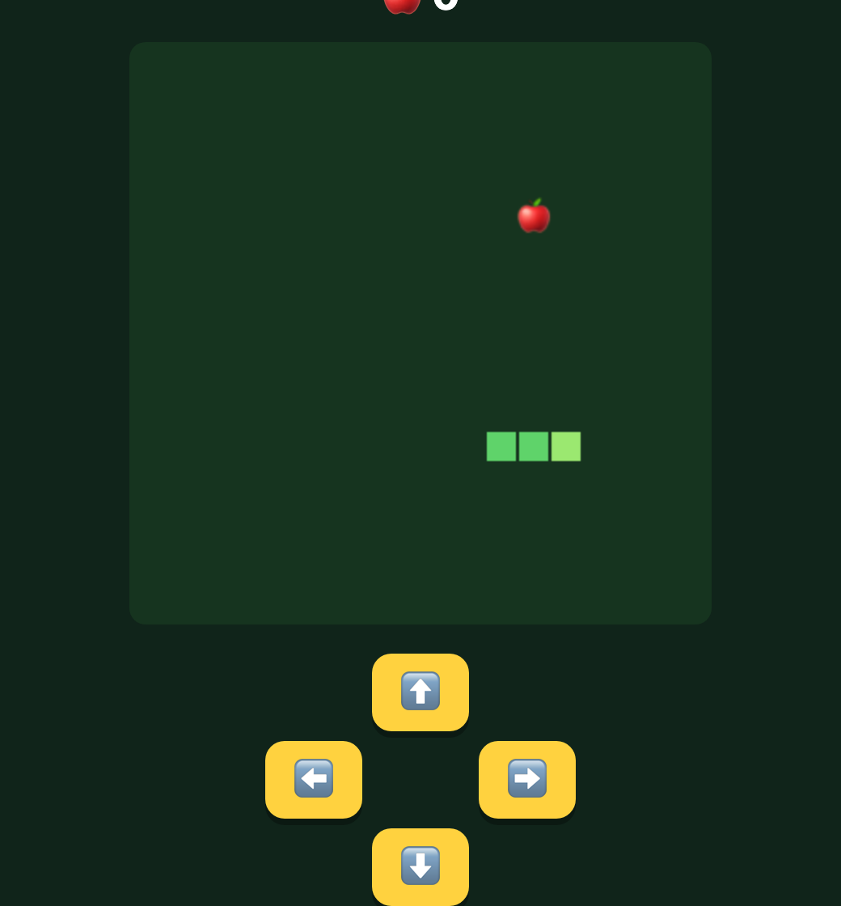
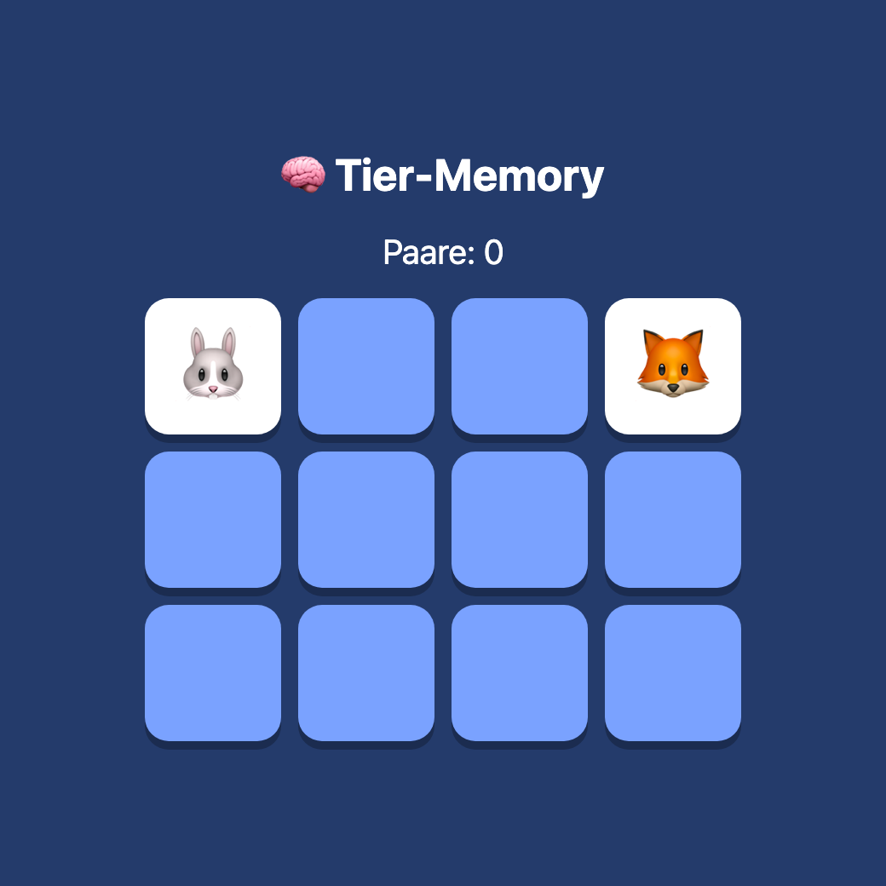
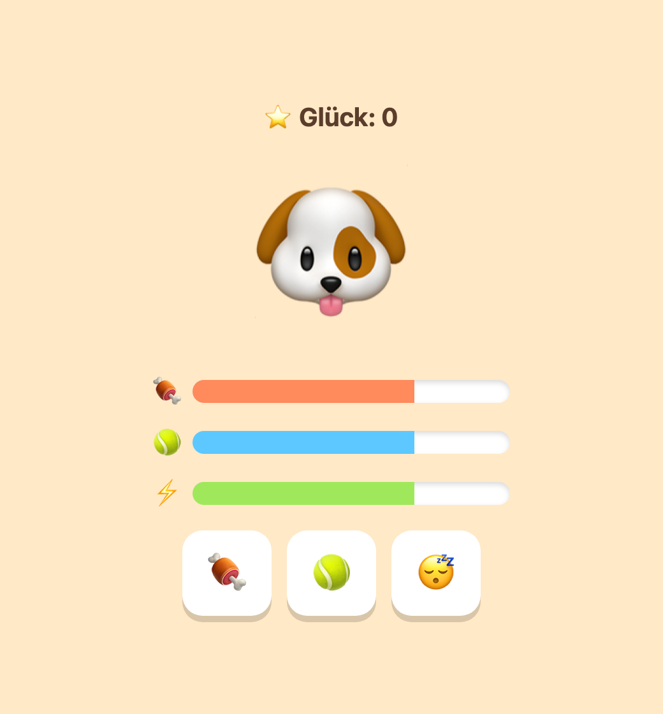

# Educational Agent Skills

Eine Sammlung von **Agent Skills** für den Bildungsbereich — gebaut, um Kindern und
Lernenden mit KI-Assistenten etwas beizubringen, statt es nur für sie zu erledigen.

Den Anfang macht ein Skill, der **Grundschulkinder ihr eigenes Computerspiel erfinden lässt** —
und ihnen dabei spielerisch beibringt, ihre Ideen in Worte zu fassen.



<p align="center"><em>Ein 3D-Spiel, beschrieben von einem Kind, gebaut von der KI — lauf herum und sammle die Sterne.</em></p>

<table>
  <tr>
    <td align="center"><br><sub>🍩 Fangspiel</sub></td>
    <td align="center"><br><sub>🐍 Snake</sub></td>
    <td align="center"><br><sub>🧠 Memory</sub></td>
    <td align="center"><br><sub>🐶 Tier-Pflege</sub></td>
  </tr>
</table>

### 🎮 [Spiele jetzt direkt im Browser →](https://gliesche.github.io/educational-agent-skills/)

Vier fertige Beispielspiele (inkl. echtem 3D) — ein Klick, kein Download.

> **Was sind Agent Skills?**
> Skills sind kleine, wiederverwendbare „Bauanleitungen" für einen KI-Assistenten: ein Ordner
> mit einer `SKILL.md` (was der Assistent tun soll und wann) und optionalen Referenz-Dateien.
> Der Assistent lädt einen Skill nur dann, wenn er zur Aufgabe passt. Sie funktionieren u. a.
> in Claude Code und in der Claude Desktop App / auf claude.ai.

---

## Skills in dieser Sammlung

| Skill | Altersstufe | Was es tut |
|---|---|---|
| [`spiele-erfinden`](skills/spiele-erfinden/) | **≈6–12** (adaptiv, Kl. 1–6) | Begleitet Kinder Schritt für Schritt, ihr eigenes Browser-Spiel zu erfinden. **Passt sich dem Alter an** (Sprache, Leseaufwand, Schwierigkeit; bei Älteren optional ein Blick hinter die Kulissen = echtes Coding/Prompting). Klickbare Auswahl-Knöpfe statt Tippen, eine Frage nach der anderen. **10 Spiel-Typen** (Fangen, Hüpfen, Klicken, Labyrinth, Quiz, Memory, Renn-Spiel, Snake, Tier-Pflege) — sogar **echtes 3D** zum Herumlaufen. Kernidee: Kinder lernen das **Beschreiben (Prompten)**. |

Die Sammlung ist über die Spalte **Altersstufe** nach Klassenstufe auffindbar. Jeder Skill ist
intern alters-adaptiv, statt nach Klassen aufgeteilt zu sein — so bleiben die geteilten Bausteine
(Spiel-Vorlagen, Pädagogik) an *einer* Stelle und driften nicht auseinander.

Weitere Skills folgen. Ideen und Beiträge sind willkommen — siehe [Mitmachen](#mitmachen).

---

## Beispiel: Was Kinder bauen

Im Ordner [`examples/einhorn-donuts/`](examples/einhorn-donuts/) liegt ein fertiges Spiel, das
mit dem `spiele-erfinden`-Skill entstanden ist: Ein Einhorn 🦄 fängt im Regenbogen-Land Donuts 🍩
und weicht Regenwolken ⛈️ aus. Einfach `index.html` im Browser öffnen und spielen — Steuerung
mit Maus oder Pfeiltasten.

Jedes Spiel ist **eine einzige HTML-Datei**: läuft offline, ohne Installation, auf jedem Rechner.

---

## Installation

Skills lassen sich auf zwei Wegen nutzen — such dir den passenden aus.

### A) Claude Code (Terminal)

Kopiere den gewünschten Skill in deinen persönlichen Skills-Ordner:

```bash
cp -R skills/spiele-erfinden ~/.claude/skills/
```

Danach steht er in jeder Sitzung bereit — entweder über den Befehl `/spiele-erfinden` oder
indem du einfach schreibst „lass uns ein Spiel bauen".

### B) Claude Desktop App / claude.ai

Hier werden Skills als `.zip` hochgeladen. Erzeuge das Paket mit dem mitgelieferten Script:

```bash
./scripts/package-skill.sh spiele-erfinden
# -> erzeugt dist/spiele-erfinden.zip
```

Dann in der App: **Einstellungen → Customize → Skills → `+`** und die `.zip` auswählen.

> **Gut zu wissen:** In der Desktop-/Web-App baut der Skill das Spiel als **interaktives
> Artifact** (sofort spielbar im Fenster daneben), statt eine Datei zu speichern — das ist für
> Kinder besonders angenehm. Der Skill erkennt seine Umgebung selbst und wählt den richtigen Weg.

---

## Für Eltern & Lehrkräfte

- **Setting:** Gedacht für ein Kind oder eine Kleingruppe an einem Rechner. Setz dich daneben.
- **Das Kind tippt selbst.** Die Sprache ist bewusst sehr einfach gehalten, und wo es geht, gibt
  es klickbare Knöpfe statt Tippfelder.
- **Sicherheit:** Der Skill bleibt durchgängig kindgerecht und freundlich — nichts Gruseliges
  oder Gewalttätiges, und er lenkt unpassende Wünsche sanft auf harmlose Varianten um.
- **Lernziel:** Nicht das fertige Spiel ist das Wichtigste, sondern dass das Kind merkt:
  *Je besser ich meine Idee beschreibe, desto cooler wird mein Spiel.*
- **Warum so?** Die Gestaltung folgt belegten pädagogischen Prinzipien (Konstruktionismus,
  Selbstbestimmungstheorie, Flow, Growth Mindset, „low floor / wide walls"). Die Grundlagen mit
  Quellen stehen in [docs/paedagogik.md](docs/paedagogik.md).

---

## Mitmachen

Beiträge sind willkommen — neue Educational Skills, Verbesserungen, Übersetzungen,
weitere Spiel-Vorlagen.

1. Repo forken
2. Neuen Skill unter `skills/<name>/` anlegen (mit `SKILL.md`; Name klein und mit Bindestrichen)
3. Kurz in der Skills-Tabelle oben ergänzen
4. Pull Request öffnen

Halte Skills einfach, freundlich und altersgerecht. Erkläre im `SKILL.md` lieber das *Warum*
als starre Regeln aufzustellen.

---

## Lizenz

[MIT](LICENSE) — frei nutzbar, anpassbar und weitergebbar, auch im Unterricht und kommerziell.

---

> *Hinweis: Dies ist ein unabhängiges Community-Projekt und steht in keiner offiziellen
> Verbindung zu Anthropic.*
